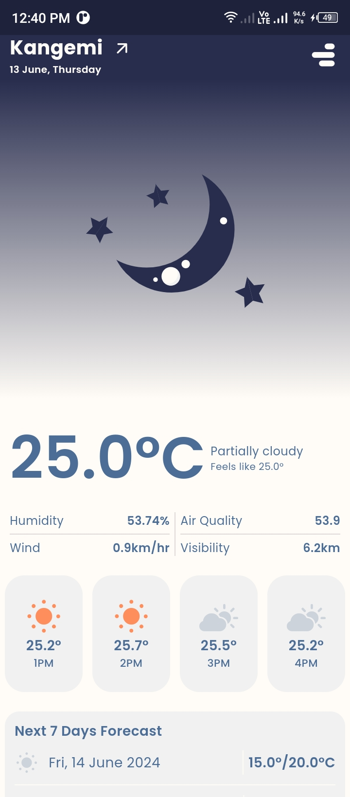

# 🔖Njeve

### Njeve, meaning "cold" in Kenyan slang, is your go-to app for staying informed about the weather.

This app provides real-time weather updates, keeping you prepared for whatever
Mother Nature throws your way. Plus, Njeve's handy offline features ensure you have access
to the latest forecast, even without an internet connection.

## Project Screenshots

**Here's a glimpse of what this project offers:**

| Splash Screen                                 | Landing Page                                 | Landing Page                                 | Landing Page                                 | Permission Request Toast                     |
|-----------------------------------------------|----------------------------------------------|----------------------------------------------|----------------------------------------------|----------------------------------------------|
|  |  |  |  |  |

| Permission Request                                | Permission Error                               | Sunny View                                 | Moon View                                    | Rainy View                                   |
|---------------------------------------------------|------------------------------------------------|--------------------------------------------|----------------------------------------------|----------------------------------------------|
|  |  |  |  |  |

## Key Features

To improve the user experience and reduce data usage, the app implements the following features:

 - **Offline data caching:** Weather data is cached for 5 hours after it's retrieved, 
allowing users to interact with the app even without an internet connection. 
This saves users data by displaying the most recent data available.
 - **Refresh option:** Users can manually refresh the data by clicking the arrow next 
to their address, ensuring they have the latest information whenever they need it.

### Benefits:

 - **Reduced data consumption:** By caching data, users can avoid unnecessary data downloads,
especially beneficial for those with limited data plans.
 - **Improved user experience:** Offline data access allows users to view weather information
even when offline.
 - **Cost savings:** Reduced API calls lead to lower subscription costs for the app.

## Download Njeve
 - [Download From Google Drive](https://drive.google.com/file/d/1v7HPINARBm1BpcrURCD9UdW9H6RvFtwe/view?usp=sharing)
 - [Download From Diawi](https://i.diawi.com/vqGzg3)

## Getting Started

This project is a starting point for a Flutter application.

A few resources to get you started if this is your first Flutter project:

- [Lab: Write your first Flutter app](https://docs.flutter.dev/get-started/codelab)
- [Cookbook: Useful Flutter samples](https://docs.flutter.dev/cookbook)

For help getting started with Flutter development, view the
[online documentation](https://docs.flutter.dev/), which offers tutorials,
samples, guidance on mobile development, and a full API reference.
